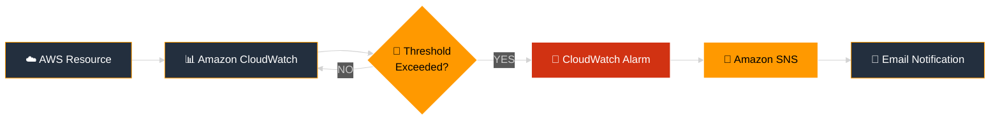

<div align="center">


<br>

---
<br><br>

### 👇 Click The Link To Explore My Project Documentation

[CPU Utilization.pdf](https://github.com/user-attachments/files/30872372/CPU.Utilization.pdf)


</a>

<br><br>

<sub>☁️ AWS CloudWatch  •  🔔 SNS  •  🚨 Monitoring  •  ⚡ Automation</sub>

</div>

---

<div align="center">


<br>

⭐ **If you found this project useful, give it a star!**

</div>


<br><br>

</div>

---

## ⚡ Project Overview

> **A real-time AWS monitoring and automated notification system using Amazon CloudWatch and Amazon SNS.**

This project demonstrates how AWS services can work together to **monitor infrastructure, detect abnormal conditions, trigger alarms, and automatically notify users**.

```text
        ┌──────────────────┐
        │   AWS RESOURCE   │
        │   EC2 / Service  │
        └────────┬─────────┘
                 │
                 ▼
        ┌──────────────────┐
        │  ☁️ CLOUDWATCH   │
        │ Metric Monitoring │
        └────────┬─────────┘
                 │
                 ▼
        ┌──────────────────┐
        │ 🚨 ALARM TRIGGER │
        │ Threshold Check  │
        └────────┬─────────┘
                 │
                 ▼
        ┌──────────────────┐
        │   🔔 AMAZON SNS  │
        │ Notification Hub │
        └────────┬─────────┘
                 │
                 ▼
        ┌──────────────────┐
        │   📧 EMAIL ALERT │
        │  Instant Notify  │
        └──────────────────┘
```

---

## 🧠 Architecture



---

## 🔄 Monitoring Workflow

```text
1️⃣  RESOURCE
    ↓
    AWS resource generates metrics

2️⃣  MONITOR
    ↓
    CloudWatch collects the metrics

3️⃣  ANALYZE
    ↓
    Alarm evaluates configured threshold

4️⃣  DETECT
    ↓
    Alarm changes state when threshold is breached

5️⃣  NOTIFY
    ↓
    SNS publishes notification

6️⃣  RESPOND
    ↓
    User receives real-time alert
```

---

## 🛠️ AWS Services Used

<div align="center">

|       ☁️ Service      | 🎯 Purpose                         |
| :-------------------: | :--------------------------------- |
| **Amazon CloudWatch** | Infrastructure & metric monitoring |
|  **CloudWatch Alarm** | Threshold-based alert detection    |
|     **Amazon SNS**    | Notification delivery              |
|       **Email**       | Real-time alert reception          |

</div>

---

## 📸 Project Flow

```text
        📊 METRICS
            │
            ▼
     ┌───────────────┐
     │  CloudWatch   │
     └───────┬───────┘
             │
             ▼
      ┌────────────┐
      │   Alarm    │
      └─────┬──────┘
            │
       Threshold?
       ┌────┴────┐
       │         │
      NO        YES
       │         │
       ▼         ▼
    Continue   Trigger
                │
                ▼
          ┌───────────┐
          │    SNS    │
          └─────┬─────┘
                │
                ▼
          📧 EMAIL ALERT
```

---

## 🎯 Key Features

* ⚡ **Real-Time Monitoring**
* 📊 **Metric-Based Detection**
* 🚨 **Automated CloudWatch Alarms**
* 🔔 **SNS Notification System**
* 📧 **Email Alerting**
* ☁️ **Serverless Monitoring Architecture**
* 🔄 **Event-Driven Workflow**
* 🛡️ **Improved Infrastructure Visibility**

---

## 🧪 Example Scenario

Imagine an **EC2 instance** suddenly reaches high CPU utilization.

```text
CPU Usage
   │
100%│                    🚨
   │                   ╱
 80%│─────────────── Alarm Threshold
   │              ╱
 60%│            ╱
   │          ╱
 40%│────────╱
   │
   └──────────────────────────► Time
```

CloudWatch detects the threshold violation:

```text
🚨 HIGH CPU DETECTED
        ↓
CloudWatch Alarm
        ↓
Amazon SNS
        ↓
📧 "EC2 CPU utilization is high!"
```

This allows administrators to **identify issues quickly and respond before they become major incidents.**

---

## 📚 What I Learned

```text
☁️ AWS Cloud Monitoring
       ↓
📊 CloudWatch Metrics
       ↓
🚨 Alarm Configuration
       ↓
🔔 SNS Topics & Subscriptions
       ↓
📧 Automated Notifications
       ↓
🛡️ Infrastructure Reliability
```

### Key Concepts

* Understanding CloudWatch metrics
* Creating CloudWatch alarms
* Configuring alarm thresholds
* Creating SNS topics
* Managing SNS subscriptions
* Connecting CloudWatch with SNS
* Building event-driven AWS workflows

---

## 🔮 Future Enhancements

```text
Current
  │
  ├── ☁️ CloudWatch
  ├── 🚨 Alarms
  └── 🔔 SNS
       │
       ▼
Future
  │
  ├── ⚡ AWS Lambda
  ├── 📱 SMS Alerts
  ├── 💬 Slack Integration
  ├── 📊 CloudWatch Dashboard
  ├── 🏗️ Terraform Automation
  └── 🤖 Automated Remediation
```

---

## 🏆 Project Highlights

<div align="center">

### ☁️ MONITOR

**Observe AWS infrastructure in real time**

⬇️

### 🚨 DETECT

**Identify abnormal conditions automatically**

⬇️

### 🔔 NOTIFY

**Send instant notifications through SNS**

⬇️

### ⚡ RESPOND

**Take action before small issues become incidents**

</div>

---

## 💻 Skills Demonstrated


<br><br>

`AWS` `CloudWatch` `SNS` `Cloud Monitoring` `Alerting` `Event-Driven Architecture` `Infrastructure Monitoring`

---

## 🌟 Why This Project?

This project provides practical experience with one of the most important concepts in cloud engineering:

> **Don't just deploy infrastructure — monitor it, detect problems, and respond automatically.**

---

<div align="center">

<br><br>

⭐ **If you found this project useful, consider giving it a star!**

<br>


</div>


---

---
